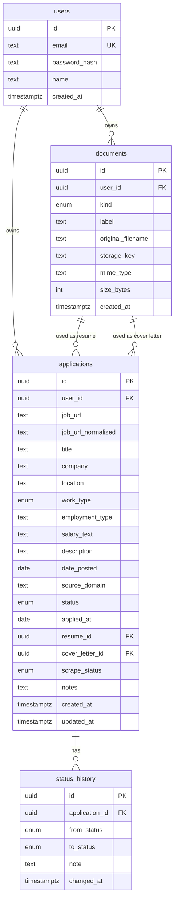

# Data Model

Database: PostgreSQL 16. ORM: SQLAlchemy 2.0. Migrations: Alembic.
All primary keys are UUIDs. All timestamps are `timestamptz` stored in UTC.

## Entity relationships

## Enums

| Enum | Values |
|---|---|
| `application_status` | `applied`, `screening`, `interviewing`, `offer`, `accepted`, `rejected`, `withdrawn` |
| `document_kind` | `resume`, `cover_letter` |
| `work_type` | `remote`, `hybrid`, `onsite`, `unknown` |
| `scrape_status` | `success`, `partial`, `failed`, `manual` |

## Tables

### users
| Column | Type | Notes |
|---|---|---|
| id | uuid | PK, default `gen_random_uuid()` |
| email | text | unique, stored lowercased, not null |
| password_hash | text | argon2 hash, not null |
| name | text | not null |
| created_at | timestamptz | default now() |

### documents
| Column | Type | Notes |
|---|---|---|
| id | uuid | PK |
| user_id | uuid | FK to users, ON DELETE CASCADE, indexed |
| kind | document_kind | not null |
| label | text | user-friendly name, not null |
| original_filename | text | for display and download name only |
| storage_key | text | random UUID-based key, unique, never derived from filename |
| mime_type | text | validated server-side |
| size_bytes | integer | max 5 MB |
| created_at | timestamptz | default now() |

Files live in storage (local disk in dev). The database stores metadata only, never file contents.

### applications
| Column | Type | Notes |
|---|---|---|
| id | uuid | PK |
| user_id | uuid | FK to users, ON DELETE CASCADE, indexed |
| job_url | text | URL as the user pasted it, not null |
| job_url_normalized | text | tracking params and fragment removed, not null |
| title | text | job title, nullable (scrape may fail) |
| company | text | nullable |
| location | text | nullable |
| work_type | work_type | default `unknown` |
| employment_type | text | e.g. full-time, contract; nullable |
| salary_text | text | free text as found, nullable |
| description | text | clean plain text, nullable |
| date_posted | date | nullable |
| source_domain | text | e.g. `example.com`; derived from URL |
| status | application_status | default `applied`, not null |
| applied_at | date | defaults to today |
| resume_id | uuid | FK to documents, ON DELETE SET NULL, nullable |
| cover_letter_id | uuid | FK to documents, ON DELETE SET NULL, nullable |
| scrape_status | scrape_status | how the data was obtained |
| notes | text | user notes, nullable |
| created_at | timestamptz | default now() |
| updated_at | timestamptz | updated on every change |

**Constraints and indexes**
- Unique: `(user_id, job_url_normalized)` to prevent duplicates.
- Index: `(user_id, status)`, `(user_id, applied_at DESC)`, `(user_id, updated_at DESC)`.
- Application layer check: `resume_id` must reference a document with `kind = 'resume'` and the same `user_id`; `cover_letter_id` must reference `kind = 'cover_letter'` and the same `user_id`.

### status_history
| Column | Type | Notes |
|---|---|---|
| id | uuid | PK |
| application_id | uuid | FK to applications, ON DELETE CASCADE, indexed |
| from_status | application_status | nullable (null for the initial `applied` entry) |
| to_status | application_status | not null |
| note | text | optional |
| changed_at | timestamptz | default now() |

A row is inserted when an application is created (from null to `applied`) and every time its status changes.

## Notes
- Search on company and title uses `ILIKE` for the MVP. Add a trigram or full-text index later if needed.
- Deleting a user cascades to their applications, documents, and history. The storage files must also be removed by the service layer.
